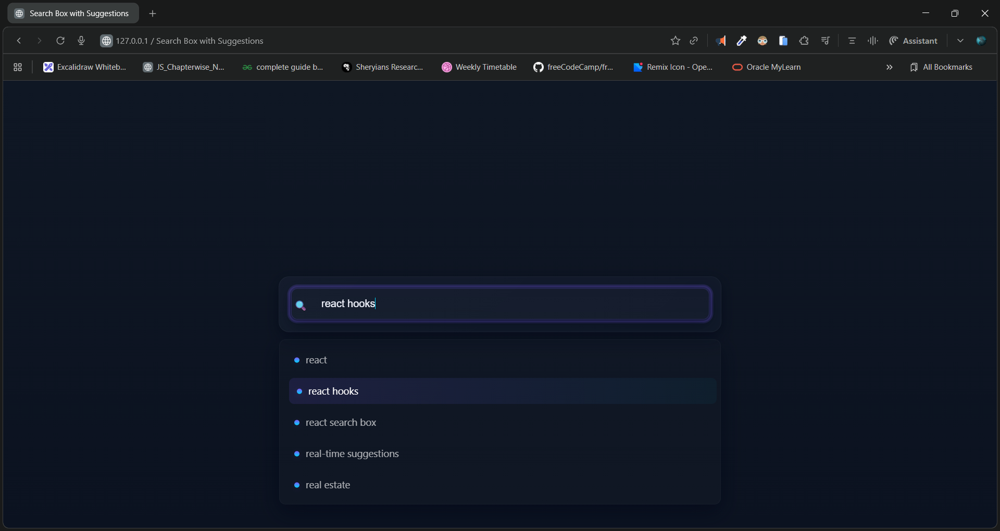

# 🚀 Search Box with Auto-Suggestions

A modern, glass-morphism styled search box with dynamic suggestions and keyboard navigation (↑ ↓).
Built using **HTML, CSS, and Vanilla JavaScript**.

---

## 📸 Preview



---

## 🌐 Live Demo

👉 **Live Site:** []()

---

## 🎥 Demo Video

👉 **Watch Demo:** [click to watch](./demo.mp4)

---

## ✨ Features

* 🔍 **Real-time suggestions** based on user input
* ⌨️ **Keyboard navigation** (Arrow Up / Arrow Down)
* 🎨 **Beautiful glass UI** with smooth transitions
* ⚡ **Pure JavaScript implementation**
* 🟣 Gradient highlight effects for selected suggestions
* 💡 Clean, responsive design

---

## 📁 Project Structure

```
📦 Search-Suggestions
 ┣ 📜 index.html
 ┣ 📜 style.css
 ┣ 📜 script.js
 ┗ 📜 README.md
```

---

## 🚧 How It Works

### **index.html**

Contains the UI structure — search box, suggestion container, and heading


### **script.js**

Handles filtering, suggestion display, and keyboard navigation


### **style.css**

Implements a modern aesthetic with glass effects, gradients, and animations


---

## 🛠️ Installation & Usage

1. **Clone the project**

```bash
git clone 
```

2. **Open the project**

```bash
cd your-repo
```

3. **Run locally**

Just open `index.html` in your browser — no server needed!

---

## 💡 Future Enhancements

* ✔ Add fuzzy search
* ✔ Fetch suggestions from API
* ✔ Dark/Light mode
* ✔ Mobile gesture support

---

## 🙌 Contributing

Pull requests are welcome!
If you'd like to enhance features or fix bugs, feel free to open an issue.

---

## 🧑‍💻 Author

Made with ❤️ by **Dileep kumawat**
- 📧 [dileepkumawat525@gmail.com](mailto:dileepkumawat525@gmail.com)
- 🔗 [LinkedIn](https://www.linkedin.com/in/dileep-kumawat/)

---

## 📜 License

This project is licensed under the **MIT License**.

---